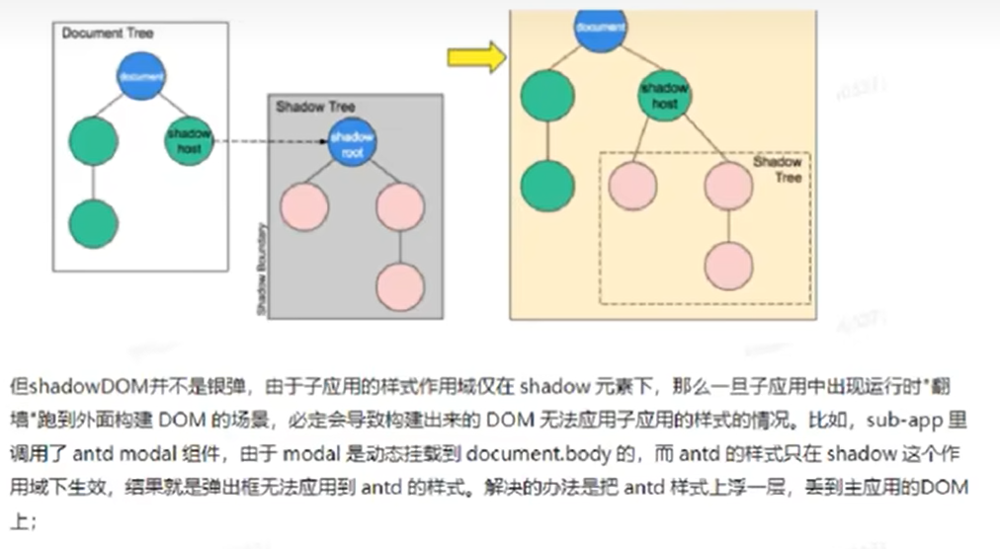

希望可以看下小哇老师的可，然后再来！！更新这里
此外
    对于图片是否有瀑布流处理
    对于从｛｝到赋值，是否会引发更新

之前录好的视频：
    iframe的一些问题，
    背景，如何加载
自己手动再录的视频：
    原理
    如何隔离（js、css）

小哇老师的课 
    相同类型遇到的问题：这些会被调整
        1、公共依赖的抽离
        2、路由状态的刷新
        3、预加载，prefetch
        4、【稳定性处理】大量数据注入过来会怎么调整，比如双11，有什么数据预案吗？不好的话项目都挂掉了

iframe 是隔离的太完善了，
wujie、qiankun、京东的microApp，EMP,singleSPA（其实也不完全是） 
样式隔离
    1、shadowDOM , 
    